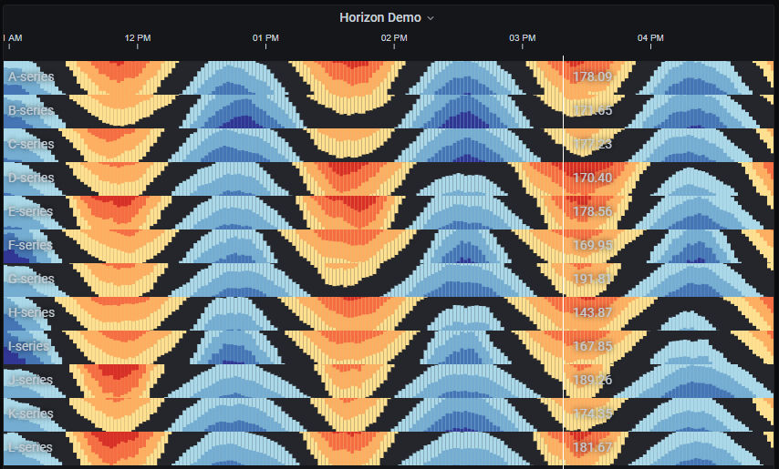
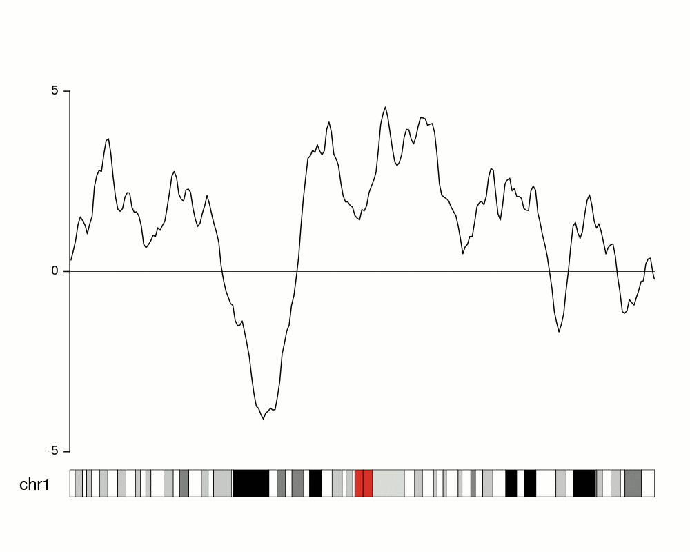

## Grafana Plugin Horizon

Grealtly inspired by [small multiples](https://en.wikipedia.org/wiki/Small_multiple) from the almighty data visualization world. Small multiple "***is a series of similiar** graphs or charts  using the same scale and axes, allowing them **to be easily compared***".

One first approach on utilizing this plugin would would be to give the user a bird's-eye view of what one's willing to monitor. Allowing the user to quickly grasp changes and insights.

## Demo

## Concepts
### What is a Horizon Plot?
https://bernatgel.github.io/karyoploter_tutorial/Tutorial/PlotHorizon/PlotHorizon.html

## First Release 0.1.0
What's in this first release?
* 4 vis engines:
    * Regular
    * Horizon
    * Discrete
    * BarPlot
* Sketchy vis
* Show:
    * Labels
    * Ruler Values
    * Mirror/Offset View
* Set:
    * bgColor 
    * Series Height
    * Series Margin
    * Bar Width
    * Bar Margin Offset
    * Thresholds

## TODO
* Sort series by some aggregation. e.g. last, mean, avg, percentile, etc.
* Shared Mouse Hover Tooltip Ruler
    * Fetch event from other panels
    * Emit to other panels
* Compress datapoints:
    * e.g. Fit 1800 datapoints into 1000 pixels
    * Get options: avg, max, first, last, percentile, etc.
* Color + Band preset:
    * e.g. Automatically generate colors palette + band.
    would need to bring ThresholdEditor to PanelBuilder. not possible atm https://github.com/grafana/grafana/issues/26554
    * Check Light Theme
        * Grab dark/light theme in code
    * Assess Timezones
    * Assess other datasources:
        * Zabbix
        * SimpleJson 

## Versioning
https://semver.org/
MAJOR.MINOR.PATCH
* Major: Incompatible API changes
* Minor: Added functionality in a backwards-compatible manner
* Patch: Backwards compatible fixes (such as bug fixes)

## Deps
* D3JSv6
* moments
* grafana/ui
* grafana/data
* grafana/runtime

## Thanks To
This plugin was heavily inspired by Mike Bostock's [cubism](https://square.github.io/cubism/) and all sorts of small multiples data visualization out there.
* Study:
    * https://bernatgel.github.io/karyoploter_tutorial/Tutorial/PlotHorizon/PlotHorizon.html
* References:
    * https://bl.ocks.org/mbostock
    * https://bl.ocks.org/emeeks
    * http://bl.ocks.org/tomshanley